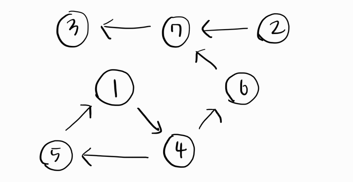

문제 출처: https://www.acmicpc.net/problem/11403
ps. 들어가서 테스트케이스 확인하면 좋음

---

### Hint

1. 그래프의 인접 행렬이 주어진다. i번째 줄의 j번째 숫자가 1인 경우에는 i에서 j로 가는 간선이 존재한다는 뜻
- 인접 행렬이 주어짐. 이를 이용해서 정점 i에서 j로 가는 경로가 있다면 인접행렬에 모두 체크해야함.

---

### 테스트케이스2



테스트케이스2는 이와 같은 방향 그래프로 구성돼있다.

이때, 예를 들어 정점 1에서 도달 가능한 정점들은 다음과 같다
1 → 1, 1 → 3, 1 → 4, 1 → 5, 1 → 6, 1 → 7

이와 같은 방식으로 각 정점마다 도달 가능한 모든 정점을 탐색하여 그 결과를 인접 행렬에 표시하면 된다.

---

DFS 풀이

```cpp
#include <bits/stdc++.h>
using namespace std;

int n, a;

int visited[101][101];

vector<int> adj[101];

void dfs(int st, int v) {
    
    for(int x : adj[v]) { // 현재 정점에서 인접한 모든 정점 확인
        if(visited[st][x] == 0) {  // 처음 방문시
            visited[st][x] = 1; // start -> x로 갈 수 있음.
            dfs(st, x);  // x를 새 출발점 삼아, start에서 어디까지 갈 수 있는지 체크
        }    
    }
}

int main() {
    
    cin >> n;
    
    for(int i=1; i<=n; i++) {
        for(int j=1; j<=n; j++) {
            cin >> a;
            if(a == 1) adj[i].push_back(j);
        }
    }
    
    for(int i=1; i<=n; i++) {
        dfs(i, i); // 시작점, 종점
    }
    
    // 정답 출력
    for (int i = 1; i <= n; i++) {
        for (int j = 1; j <= n; j++) {
            cout << visited[i][j] << ' ';
        }
        cout << '\n';
    }
}
```

---

BFS 풀이

```cpp
#include <bits/stdc++.h>
using namespace std;

int n, a;

int visited[101][101];

vector<int> adj[101];

void bfs(int st) { // st는 시작 정점
    queue<int> q;
    q.push(st);
    
    while(!q.empty()) {
        int cur = q.front(); q.pop();
        
        for(int v : adj[cur]) { // 시작 정점과 이어진 모든 정점들을 꺼낸다.
            
            if(visited[st][v] == 0) { // 처음 방문시
                visited[st][v] = 1; // st -> v 가능
                q.push(v); // st와 이어진 정점을 찾기 위해 큐에 현재 정점 삽입
            }
            
        }
    }
}

int main() {
    
    cin >> n;
    
    for(int i=1; i<=n; i++) {
        for(int j=1; j<=n; j++) {
            cin >> a;
            if(a == 1) adj[i].push_back(j);
        }
    }
    
    for(int i=1; i<=n; i++) {
        bfs(i);
    }
    
    for (int i = 1; i <= n; i++) {
        for (int j = 1; j <= n; j++) {
            cout << visited[i][j] << ' ';
        }
        cout << '\n';
    }
}
```

---

플로이드-워셜 풀이

```cpp
#include <bits/stdc++.h>
using namespace std;

int n;
int graph[100][100];

int main() {
    
    cin >> n;
    
    for(int i=0; i<n; i++) {
        for(int j=0; j<n; j++) {
            cin >> graph[i][j];
        }
    }
    
    // i -> k로 가고, k -> j로 간다면, i -> j 가능.
    for(int k=0; k<n; k++) { // k = 중간에 거쳐가는 정점
        for(int i=0; i<n; i++) { // 출발 정점
            for(int j=0; j<n; j++) { // 도착 정점
                if(graph[i][k] && graph[k][j]) graph[i][j] = 1;
            }
        }
    }
    
    // 정답 출력
    for (int i = 0; i < n; i++) {
        for (int j = 0; j < n; j++) {
            cout << graph[i][j] << ' ';
        }
        cout << '\n';
    }
    
}
```
